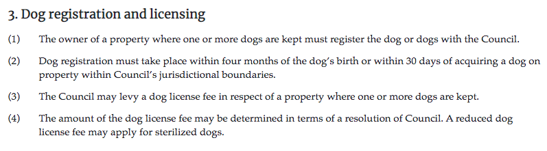

# Content API quick start

This quick start shows you how to fetch legislation from the Content API. Use
this path when your application needs full legislation content or metadata.

You will:

1. create a Laws.Africa account and API token;
2. list available legislation;
3. fetch metadata for a work;
4. fetch HTML for a legislation portion;
5. display the HTML.


If you want search, RAG, legal agents or AI grounding, start with the
[Knowledge Base quick start](../knowledge-bases/quick-start.md) instead.


## Create an API token

1. Sign up at [https://platform.laws.africa/](https://platform.laws.africa/).
2. Get your API token from
   [https://platform.laws.africa/api-keys/](https://platform.laws.africa/api-keys/).

In the examples below, replace `<YOUR_AUTH_TOKEN>` with your token.

Content API requests count toward your account's plan limits. Listing and
crawling paginated collections can use many calls, so monitor usage in the
platform and read the guidance in
[manage your plan and subscription](../get-started/manage-your-plan.md).

## Get a list of by-laws

Fetch a list of municipal by-laws for the City of Cape Town.

```bash
curl -H "Authorization: Bearer <YOUR_AUTH_TOKEN>" \
  https://api.laws.africa/v3/akn/za-cpt/.json
```

The `za-cpt` part of the URL identifies the City of Cape Town in South Africa.

## Fetch the Animal By-law

Fetch metadata for Cape Town's Animal By-law in JSON format.

```bash
curl -H "Authorization: Bearer <YOUR_AUTH_TOKEN>" \
  https://api.laws.africa/v3/akn/za-cpt/act/by-law/2011/animal.json
```

The response includes the title, publication details and links to additional API
calls.

Fetch the table of contents:

```bash
curl -H "Authorization: Bearer <YOUR_AUTH_TOKEN>" \
  https://api.laws.africa/v3/akn/za-cpt/act/by-law/2011/animal/toc.json
```

Fetch the HTML content for section 3:

```bash
curl -H "Authorization: Bearer <YOUR_AUTH_TOKEN>" \
  https://api.laws.africa/v3/akn/za-cpt/act/by-law/2011/animal/eng/!main~chp_2__sec_3
```

## Display the by-law

Use [Laws.Africa Law Widgets](https://github.com/laws-africa/law-widgets/blob/main/core/README.md)
to style Akoma Ntoso HTML.

```markup
<script type="module" src="https://cdn.jsdelivr.net/npm/@lawsafrica/law-widgets@latest/dist/lawwidgets/lawwidgets.esm.js"></script>

<la-akoma-ntoso>
  <section class="akn-section" id="section-3" data-id="section-3">
    <h3>3. Dog registration and licensing</h3>
    <section class="akn-subsection" id="section-3.1" data-id="section-3.1">
      <span class="akn-num">(1)</span>
      <span class="akn-content"><span class="akn-p">The owner of a property where one or more dogs are kept must register the dog or dogs with the Council.</span></span>
    </section>
  </section>
</la-akoma-ntoso>
```



## Next steps

* Learn about [works and expressions](concepts/works-and-expressions.md).
* Browse the [Content API reference](reference/README.md).
* Follow the
  [advanced Content API tutorial](../tutorials/content-api-legislation-reader/about-the-tutorial.md).
