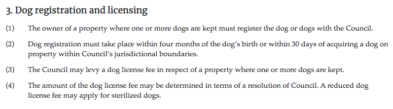

# Quick start

This quick start guide will get you started with fetching legislation from the Laws.Africa Content API. It includes:

1. Signing up for a Laws.Africa account
2. Listing available legislation
3. Fetching the HTML for a piece of legislation
4. Displaying the HTML


This guide uses the Cape Town by-laws as example content, which is free and doesn't require an API subscription. Other content such as national laws require a subscription.

Find out more about API subscriptions and licensing terms at [https://laws.africa/api/detail](https://laws.africa/api/detail).


### Create an account

To get started, you'll need a free Laws.Africa account and API token.

1. Sign up for a free Laws.Africa account at [https://edit.laws.africa/accounts/login/](https://edit.laws.africa/accounts/login/)
2. Get your API token from [https://edit.laws.africa/accounts/profile/api/](https://edit.laws.africa/accounts/profile/api/)


In the examples below, replace `<YOUR_AUTH_TOKEN>` with your personal API token.

Once you're signed into your account, you can also visit the API URLs in your browser.


### Get a list of by-laws

Fetch a list of the by-laws (municipal legislation) for the City of Cape Town.

```bash
$ curl -H "Authorization: Token <YOUR_AUTH_TOKEN>" \
  https://api.laws.africa/v3/akn/za-cpt/.json
```

The `za-cpt`  part of the URL identifies the City of Cape Town in South Africa.

### Fetch the Animal by-law

Let's fetch the details of Cape Town's Animal by-law, in JSON format. This includes the title, publication details and a list of other API calls you can make for additional details.

```bash
$ curl -H "Authorization: Token <YOUR_AUTH_TOKEN>" \
  https://api.laws.africa/v3/akn/za-cpt/act/by-law/2011/animal.json
```

Laws.Africa can provide us with a Table of Contents for the by-law, also in JSON format. Let's fetch that:

```bash
$ curl -H "Authorization: Token <YOUR_AUTH_TOKEN>" \
  https://api.laws.africa/v3/akn/za-cpt/act/by-law/2011/animal/toc.json
```

Now let's get the HTML content of Section 3 of the by-law, regarding dog registration and licensing:

```bash
$ curl -H "Authorization: Token <YOUR_AUTH_TOKEN>" \
  https://api.laws.africa/v3/akn/za-cpt/act/by-law/2011/animal/eng/!main~chp_2__sec_3
```

### Display the by-law

Finally, let's put that HTML into a webpage and include the [Laws.Africa Law Widgets](https://github.com/laws-africa/law-widgets/blob/main/core/README.md) to apply stylesheets to make it look good:

```markup
<script type="module" src="https://cdn.jsdelivr.net/npm/@lawsafrica/law-widgets@latest/dist/lawwidgets/lawwidgets.esm.js"></script>

<la-akoma-ntoso>
  <section class="akn-section" id="section-3" data-id="section-3">
    <h3>3. Dog registration and licensing</h3>
    <section class="akn-subsection" id="section-3.1" data-id="section-3.1">
      <span class="akn-num">(1)</span>
      <span class="akn-content"><span class="akn-p">The <span class="akn-term" data-refersTo="#term-owner" id="trm78" data-id="trm78">owner</span> of a property where one or more dogs are kept must register the <span class="akn-term" data-refersTo="#term-dog" id="trm79" data-id="trm79">dog</span> or dogs with the <span class="akn-term" data-refersTo="#term-Council" id="trm80" data-id="trm80">Council</span>.</span></span>
    </section>
    <section class="akn-subsection" id="section-3.2" data-id="section-3.2">
      <span class="akn-num">(2)</span>
      <span class="akn-content"><span class="akn-p">Dog registration must take place within four months of the <span class="akn-term" data-refersTo="#term-dog" id="trm81" data-id="trm81">dog</span>&#8217;s birth or within 30 days of acquiring a <span class="akn-term" data-refersTo="#term-dog" id="trm82" data-id="trm82">dog</span> on property within <span class="akn-term" data-refersTo="#term-Council" id="trm83" data-id="trm83">Council</span>&#8217;s jurisdictional boundaries.</span></span>
    </section>
    <section class="akn-subsection" id="section-3.3" data-id="section-3.3">
      <span class="akn-num">(3)</span>
      <span class="akn-content"><span class="akn-p">The <span class="akn-term" data-refersTo="#term-Council" id="trm84" data-id="trm84">Council</span> may levy a <span class="akn-term" data-refersTo="#term-dog" id="trm85" data-id="trm85">dog</span> license fee in respect of a property where one or more dogs are kept.</span></span>
    </section>
    <section class="akn-subsection" id="section-3.4" data-id="section-3.4">
      <span class="akn-num">(4)</span>
      <span class="akn-content"><span class="akn-p">The amount of the <span class="akn-term" data-refersTo="#term-dog" id="trm86" data-id="trm86">dog</span> license fee may be determined in terms of a resolution of <span class="akn-term" data-refersTo="#term-Council" id="trm87" data-id="trm87">Council</span>. A reduced <span class="akn-term" data-refersTo="#term-dog" id="trm88" data-id="trm88">dog</span> license fee may apply for sterilized dogs.</span></span>
    </section>
  </section>
</la-akoma-ntoso>
```



## Next steps

* [The Tutorial](broken-reference) goes step-by-step through building a Django application that display legislation fetched from the Laws.Africa Content API.
* Browse the [API documentation](overview.md).


[overview.md](overview.md)

